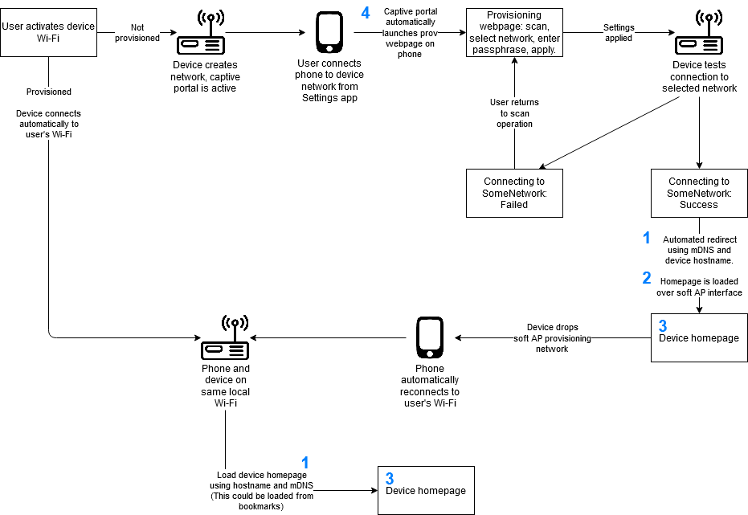

# Captive Portal for Provisioning and Configuration

## Problem
Configuration of Wi-Fi settings, a process commonly known as "provisioning," presents a significant challenge for embedded devices. The steps for provisioning a device are often clunky and prone to error, leading to a poor user experience. The goal is to provide a flow that is seamless, automatic, and intuitive.

## Solution
Wi-Fi networks support a concept known as the "captive portal." A captive portal is a forced redirect of all web requests to a fixed webpage. It is used by providers of public Wi-Fis (hotels, coffee shops) to force agreement to a ToS or provide a login before internet access is allowed.

An increasing number of Arduino and Hackerspace enthusiasts have latched on to the idea of using the captive portal to provide a network configuration page. Functionality includes at least the following:
- Ability to scan for networks
- Ability to select a network and enter a passphrase
- Ability to apply settings and have device join the selected network

This solution is reasonable when other solutions, such as a custom app, are not an option. Most of the support and tutorials for this exist in the Arduino/hackerspace community. This project creates a captive portal solution directly on top of the Espressif IoT framework (ESP-IDF).

## Project Organization
### C Source
This project is based on a combination of the `wifi_prov_mgr` and `restful_server` examples of ESP-IDF. It relies on the ESP-IDF build process (cmake/ninja build invoked by `idf.py`) and adds four new components.
- **rest\_server** is the RESTful file server based on the restful\_server example project. It must be started separately and the httpd handle provided to `prov_webpage_mgr`.
- **prov\_webpage\_mgr** is the manager for the provisioning webpage. It acts as a wrapper around the ESP-IDF wifi\_provisioning component. It also acts as a client of captive\_portal if captive portal functionality is requested.
- **captive\_portal** is a captive portal implementation. It requires the netif handle, httpd handle, redirect URI, and a function pointer for the application's common GET handler. The captive portal sets itself up on only the interface provided (i.e. it operates on eiether the STA or AP interface but not both). `prov_webpage_mgr` will automatically set it up with the AP interface. captive\_portal handles redirection automatically and forwards requests to the application's common GET handler only when the beginning of the requested URI matches the redirect URI. (E.g. redirect URI is set to "/prov" and requested URI is "/prov/index.html".)
- **capt\_dns** is a subcomponent of the captive portal. It responds to all DNS requests with the IP address of the specified interface.

In addition, one of the ESP-IDF components is modified to add functionality. Its existence in the project's components directory will cause it to [automatically override](https://docs.espressif.com/projects/esp-idf/en/stable/esp32/api-guides/build-system.html#multiple-components-with-the-same-name) the implementation in ESP-IDF.
- **wifi\_provisioning** is modified to add the `wifi_prov_mgr_reset_to_ready_state()` function. This allows for reentry of Wi-Fi credentials after a failed attempt without having to restart the provisioning manager or down the soft AP.

### Webpage Source
Webpage source files exist under `front/web-demo/src`. When built, the build output goes to `front/web-demo/dist`, where it can be used for semihost, localhost, or built into a binary filesystem image for deployment. Note that `/src` and `/dist` represent the webpage root. Webfiles for the device homepage should go directly here. `prov_webpage_mgr` *assumes* the provisioning webpage files will be found in the `prov` subdirectory of the root.

There are three files that become part of the provisioning webpage. After gzip and minification, they consume **22k** of filesystem flash space. There is no reloading of this webpage after it is first loaded. All updates and changes in appearance are managed directly by the JavaScript. This includes connection success and fail notifications, and return to scanning operation after a failed connection attempt.
- **src/prov/index.html** Containers and layout for the provisioning webpage.
- **src/prov/prov.js** All of the functionality for requesting scans, applying settings, and updating the DOM. There are multiple settings that can be adjusted at the top of this file.
- **node_modules/spectre.css/dist/spectre.min.css** A lightweight CSS framework used to give a more professional look and feel. Tutorialzine has a [list](https://tutorialzine.com/2018/05/10-lightweight-css-frameworks-you-should-know-about) of other options. Note that if a different CSS framework is used, the class attribute values in `src/prov/index.html` need to be updated to match.

In addition there is a `prov/proto` directory. This contains the .proto definition files copied from ESP-IDF `components/wifi_provisioning/proto` and `components/protocomm/proto`. These files get compiled into the JavaScript and do not appear in the build output. There are three top-level files that define the communication protocol needed for interacting with the ESP-IDF wifi\_provisioning component.
- **src/prov/proto/session.proto** defines messages used to initiate a provisioning session.
- **src/prov/proto/wifi\_scan.proto** defines messages used to request a scan operation and get the results.
- **src/prov/proto/wifi\_config.proto** defines messages used to set the Wi-Fi credentials and test connection.

## How to Build
A full configuration and build should be done in the following order.

### Configuration Options
Use `idf.py menuconfig` to configure the project. The following settings can be found under Example Configuration.
- **mDNS host name** This gives the device a hostname that can be used to locate it on local networks.
- **Prefix for soft AP Wi-Fi** This specifies a prefix for the soft AP Wi-Fi network created by the device. Default is "PROV\_". The last 6 digits of the device MAC address will be appended to this prefix.
- **Password for soft AP Wi-Fi** This specifies a password for the soft AP Wi-Fi netowrk. Leave this blank for no security. If you intend to use the soft AP for more than provisioning, it is recommended to have a password.
- **Website deploy mode** This specifies what to do with the webfile build output in `front/web-demo/dist`. ~~If semihost is chosen, then an additional parameter is needed to tell the JTAG/semihost driver the filepath for your web files.~~ (See note below.)
- **Website mount point** This specifies where to mount the filesystem containing the web files. Default is "/www". Note that this is only a mount point to specify to the virtual file system (VFS). rest\_server will prepend this to the URI of incoming GET requests in order to access the file in the VFS.
- **Minify and gzip web files** Specifies whether web files should be minified and gzipped. This affects both the webpage build script and `rest_server.c`, which has conditional compilation to handle zipped or non-zipped web content. It is recommended to turn this setting off when debugging web pages in the browser, otherwise it should be left on.

#### Note about host path for semihost
*This setting in the menuconfig currently has no effect.* The `host_path` parameter to `esp_vfs_semihost_register()` has been set to `NULL`. Instead, I added the following to the command line options for OpenOCD in the Eclipse debug configuration.

`-c "set ESP_SEMIHOST_BASEDIR D:/path_to_project_dir/front/web-demo/dist"`

For whatever reason, passing the host path directly to the `esp_vfs_semihost_register()` was not working, but specifying it as a command line parameter was.

To get semihosting to work, you will need to either modify the call to `esp_vfs_semihost_register()` by changing the NULL parameter to `CONFIG_EXAMPLE_HOST_PATH_TO_MOUNT` or by adding a similar OpenOCD command line option to your debug configuration.

### Build the Webpages
For the webpage build script to work, you must have the Node.js package manager (npm) installed on your system.

The build script requires the following packages. Navigate to `front/web-demo` and run `npm install`. This will run a preinstall script to make sure you have browserify and uglify-es installed globally for npm. Then it will install pbf and spectre.css locall for the project. Alternatively, you can manually install the packages.
- [pbf](https://www.npmjs.com/package/pbf) for compiling Espressif's .proto definition files into JavaScript. Must be installed locally so that it is visible to `browserify`.
- [spectre.css](https://www.npmjs.com/package/spectre.css) for layout style. Must be installed locally so that it is visible to the webpage build script.
- [browserify](https://www.npmjs.com/package/browserify) for bundling together the JavaScript output of `pbf` and handling the `require()` statements in `prov.js`. Can be installed globally or locally.
- [uglify-es](https://www.npmjs.com/package/uglify-es) for minification of the JavaScript. Note: It must be `uglify-es` since `uglify-js` does not properly handle `ES6+`. Can be installed globally or locally.

To execute the build script, navigate to `front/web-demo` and execute `./build_webpages.sh` or alternatively `npm run build`. On Windows, Git Bash can be used to execute the script. When deploying to SD card or SPI flash, this step should be done before building the C code since the cmake configuration converts the contents of `front/web-demo/dist` into a binary partition image as part of the build process.

### Build and Flash the C Code
`idf.py build`

`idf.py flash`

## Operation and Limitations
The ideal UI flow looks like this.

Unfortunately, this flow is not completely possible. The following notes reference the blue numbers in the diagram.

### Note 1: Android Limitations
mDNS is not available in web broswers on Android. Using a device hostname and corresponding URL (e.g. hostname of "awesome-device" and URL of "http://awesome-device.local") will not work. This leaves the less desirable solution of needing to know the device IP address in order to access its homepage from a web browser. There may be some compromise solution here, such as forwarding the assigned IP address rather than the hostname to the browser. This IP address would need to get saved, either by showing it to the user or creating a bookmark. This IP address cannot be used to load the device homepage immediately following success of connection test since the phone is still on the device's network.

### Note 2: iOS Limitations
It is not possible to exit the captive portal directly to the device homepage on iOS. Once iOS detects a captive portal, it uses it to know whether the network has internet connectivety. In order for iOS to release from the captive portal, a post-authentication redirect must occur using full-page navigation. It is not enough to simply redirect to additional pages hosted by the device. If this were done (or spoofed in some manner), iOS would then think it's a fully connected Wi-Fi link (which it's not) and switch all data operations over to it.

It seems there's no way around forcing the user to manually open a web browser after the device is provisioned and connected to the user's Wi-Fi. It is possible to have the device homepage in iOS' captive-portal-mini-browser (CPMB), but it's not clear whether a bookmark here would translate to Safari (or if bookmarks here are even possible).

### Note 3: Silent Handoff for Idealized Flow
Under the idealized flow, the captive portal is released and the device homepage is loaded (via mDNS) across the soft AP. After the homepage is loaded, the device silently drops the soft AP and the phone (in the background) switches back over to the user's Wi-Fi. Since, at this point, phone and device continue to be on the same local network, webpage loads using device hostname and mDNS continue to work. The "switch of interfaces" is quiet and happens underneath the awareness of the browser. This flow has been achieved with Firefox and Windows, is not possible with Android and iOS, and has not been tested with MacOS.

### Note 4: Multiple Autorise of Captive Session
It is possible for more than one autorise to occur, causing two or more browser tabs to attempt to load the provisioning webpage simultaneously. This behavior has been witnessed on Windows with Firefox. Both Microsoft and Firefox have their own portal detect mechanism, so some conflict may have occurred here. When this happens, it causes device crash and reboot. The wifi\_provisioing component of ESP-IDF does not perform input checking, nor does it protect against simultaneous access to scan operations. The page that loads second will restart scan (wiping out previous results) while the first page is still retrieving results. This causes assertion inside of ESP-IDF.

When two autorises occur, it is not clear which browser window should take precedence. A proposed solution here would be to request scan results on page load and only initiate a scan if there are no results yet. This would lead to both windows showing the same scan results. The user would only interact with one of them.

### Note 5: Captive Portal may not Launch When Using Multiple Interfaces
Testing with Windows 10 shows that the captive portal does not automatically open if a second network interface with internet connectivity is active. In this test environment, I was using the Wi-Fi interface to connect to the device provisioning network while the Ethernet interface remained connected to internet. In this scenario, the captive portal refused to launch even though Windows was getting the 302 redirect to GET requests for http://www.msftconnecttest.com/connecttest.txt. After unplugging the Ethernet, the test worked fine.

## References
- [mDNS does not work on Android](https://android.stackexchange.com/questions/49188/how-to-get-mdns-working-for-chrome-on-android)
- [Captive Portal documentation by the Wireless Broadband Alliance](https://captivebehavior.wballiance.com/)
